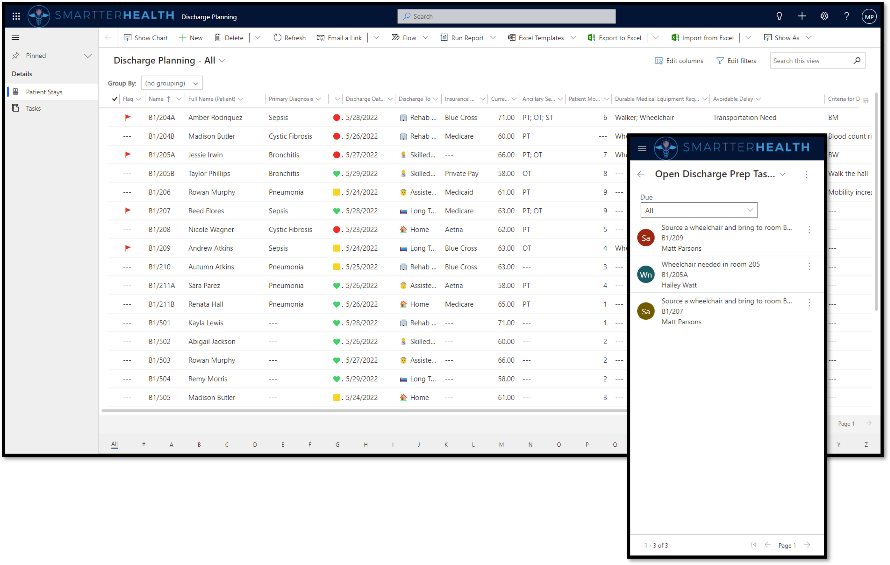

# Discharge Planning Collaboration

Leveraging capabilities in the Microsoft healthcare industry platform to address challenges felt on the front-lines of in-patient settings.

| Addressable challenges| Solution framework|
|---|------|
| - ADT system discharge messaging is latent, often not occurring until hours after patient left - On the ground, plans and reminders are handled on paper which is prone to error and puts additional burden on clinicians - Lack of reporting  - Follow up and follow through is manual  - People are hunting down the same information - Troubleshooting must be synchronized | - automate patient data  - aggregate the relevant data - Provide quick filtering and visualizations that help with prioritization  - Use secure messaging to asynchronously communicate and resolve barriers to discharge - Automate task management & reporting for process improvement |

## Features

- Identify and prioritze key activities related to the patient discharge process​
- Set a flag to easily visualize where attention is needed​
- Huddle board view for digital screen and team coordination in the building/unit​
- Display board view on Surface hub or other touchscreen device​
- Native mobile app, configurable for team members who may move between units​
- Individual team member task view and notifications​
- Push alerts and reminders via Teams​
- Automate reminders and escalations of prioritized activities

## Dependencies

- Dataverse with Healthcare data model
  - Patient (Contact)
  - Encounter
  - Location

## Deployment

1. Ensure that dependencies (above) are met and that you have an Environment Maker role (or equivalent) in the Environment
1. Deploy managed solution to a Dataverse environment
    1. Publish the *Non-Clinical Rounding* and *Rounding History* Power Apps
1. Assign security roles
1. Deploy sample data (or create your own)
1. Share app with users and assign security roles

## Major components

- Model Driven Power App: Discharge Planning
- Table: Patient Stay
- Security Roles: 
  - Discharge Planning User
  - Discharge Planning Administrator
- Automations:
  - Sample: Discharge task creation - Example automated workflow to create and assign tasks based on keywords in the "barriers" field for a Patient Stay.
  - Set Discharge Status - Sets the indicator icon based on the selected status

## Design Decisions

- Use of FHIR concept of Location to associate lists based on 
  - https://www.hl7.org/fhir/location-definitions.html

- Use of FHIR concept of Encounter to track experience across multiple locations 
  - https://www.hl7.org/fhir/encounter-definitions.html

- Use of FHIR concept of Encounter Locations to list and filter based on a status of Active
  - https://www.hl7.org/fhir/encounter-definitions.html#Encounter.location
  - This is used to show the list of beds (Locations), and allow the traversing of related information

- A configured *Patient Stays* table includes direct links to the the Patient and Location, based on the Encounter details.  
  - Allows for use of Power Platform & Dataverse features for workflow and reporting, without modification to the FHIR data.

- Use of Diagnosis and Diagnosis code fields on the PatientStay record.
  - Optional clinical information to help inform workflows, estimation of length of stay, and other details.

- Note: Ancillary services are a simple list of choices. This could be combined with "Home Adapations" (another solution that works in combination with Discharge Planning) to include more detailed workflow.

- Note: Avoidable Delays (upon capture) could populate a table of "all delays" and be used with Power BI for analytics to identify opportunities to address those challenges in the future.

- Note: Sample room map uses Power Apps experimental feature to select and open room record

## Sample Data

This repository includes sample data that allows testing/modification without requiring a live FHIR integration.

1. Import the *PatientStays.csv* file found in the solutions folder of this repository
    1. Not sure how? Navigate to *Power Apps Maker Portal->Data->Rounding Detail->Data* then use the **Import from Excel** action

1. Optional: Update references for each *Patient* record to a related Patient, Encounter, and Location. Doing so will enable additional views/reporting summarized for an Encounter (regardless of Location), summarized for a Location (regardless of Patient), etc.

## Solution History

### DischargePlanning 1.1.3

Initial release of the sample app, data model, workflows, security roles, and related configuration data to the community. Source included in the /src folder and deployable solution files included in the /solutions folder.

## Contributing

This project welcomes contributions and suggestions.  Most contributions require you to agree to a
Contributor License Agreement (CLA) declaring that you have the right to, and actually do, grant us
the rights to use your contribution. For details, visit https://cla.opensource.microsoft.com.

When you submit a pull request, a CLA bot will automatically determine whether you need to provide
a CLA and decorate the PR appropriately (e.g., status check, comment). Simply follow the instructions
provided by the bot. You will only need to do this once across all repos using our CLA.

This project has adopted the [Microsoft Open Source Code of Conduct](https://opensource.microsoft.com/codeofconduct/).
For more information see the [Code of Conduct FAQ](https://opensource.microsoft.com/codeofconduct/faq/) or
contact [opencode@microsoft.com](mailto:opencode@microsoft.com) with any additional questions or comments.

## Trademarks

This project may contain trademarks or logos for projects, products, or services. Authorized use of Microsoft 
trademarks or logos is subject to and must follow 
[Microsoft's Trademark & Brand Guidelines](https://www.microsoft.com/en-us/legal/intellectualproperty/trademarks/usage/general).
Use of Microsoft trademarks or logos in modified versions of this project must not cause confusion or imply Microsoft sponsorship.
Any use of third-party trademarks or logos are subject to those third-party's policies.

## Contributing

This project welcomes contributions and suggestions.  Most contributions require you to agree to a
Contributor License Agreement (CLA) declaring that you have the right to, and actually do, grant us
the rights to use your contribution. For details, visit https://cla.opensource.microsoft.com.

When you submit a pull request, a CLA bot will automatically determine whether you need to provide
a CLA and decorate the PR appropriately (e.g., status check, comment). Simply follow the instructions
provided by the bot. You will only need to do this once across all repos using our CLA.

This project has adopted the [Microsoft Open Source Code of Conduct](https://opensource.microsoft.com/codeofconduct/).
For more information see the [Code of Conduct FAQ](https://opensource.microsoft.com/codeofconduct/faq/) or
contact [opencode@microsoft.com](mailto:opencode@microsoft.com) with any additional questions or comments.

## Trademarks

This project may contain trademarks or logos for projects, products, or services. Authorized use of Microsoft 
trademarks or logos is subject to and must follow 
[Microsoft's Trademark & Brand Guidelines](https://www.microsoft.com/en-us/legal/intellectualproperty/trademarks/usage/general).
Use of Microsoft trademarks or logos in modified versions of this project must not cause confusion or imply Microsoft sponsorship.
Any use of third-party trademarks or logos are subject to those third-party's policies.
